### สิ่งที่น้องควรรู้สำหรับหอพักนิสิต (อ่านตรงนี้ก่อนนะ สำคัญมาก)

&nbsp;&nbsp;&nbsp;&nbsp;&nbsp;&nbsp;เพื่อการอำนวยความสะดวกแก่การเดินทางมาเข้าร่วมงานรับน้องก้าวใหม่ 2562 ทางหอพักนิสิตจุฬาลงกรณ์มหาวิทยาลัย ได้จัดที่พักสำรองไว้สำหรับน้อง ๆ ที่มีความจำเป็น ในช่วงงานรับน้องก้าวใหม่ 2562 ระหว่างวันที่ 3 – 5 สิงหาคม 2562 โดยไม่เสียค่าใช้จ่ายใด ๆ และสามารถแจ้งความจำนงขอเข้าพักหอพักนิสิตได้พร้อมกับการลงทะเบียนบ้านรับน้องออนไลน์เลย

&nbsp;&nbsp;&nbsp;&nbsp;&nbsp;&nbsp;แต่ด้วยจำนวนของที่พักที่มีอยู่อย่างจำกัด ทางหอพักนิสิตจึงขอสงวนการเข้ามาพักหอในไว้สำหรับ<strong>น้องที่ไม่ได้เป็นนิสิตหอพัก</strong>และ<strong>มีความจำเป็นอย่างยิ่งเนื่องจากไม่สามารถหาที่พักในกรุงเทพได้ด้วยตนเอง จากครอบครัว คนรู้จัก หรือพี่บ้านได้ เท่านั้น</strong>

&nbsp;&nbsp;&nbsp;&nbsp;&nbsp;&nbsp;สำหรับน้องที่เป็นนิสิตหอพัก ไม่ต้องแจ้งความจำนงใด ๆ ในการเข้าพักหอพักนิสิตในส่วนนี้ ให้ติดตามประกาศหรือรายละเอียดการย้ายเข้าห้องพักได้ที่ <a href="https://www.rcuchula.com">www.rcuchula.com</a> หรือ Facebook <a href="https://www.facebook.com/rcuchula/">สำนักงานหอพักนิสิตจุฬาลงกรณ์มหาวิทยาลัย</a>

&nbsp;&nbsp;&nbsp;&nbsp;&nbsp;&nbsp;ทั้งนี้ การจัดที่พักสำหรับน้อง ๆ ทางหอพักได้จัดเตรียมที่นอน หมอน และพัดลมจำนวนหนึ่งไว้ให้ (ไม่มีเครื่องปรับอากาศนะ) ดังนั้น การเข้าพักในสถานที่ที่หอพักนิสิตจัดไว้ให้ อาจจะไม่ได้สะดวกสบาย 100% ขอให้น้องศึกษาข้อมูลที่พัก แล้วตัดสินใจให้ดี ๆ ถ้าน้องไหว ถ้าน้องโอเค ก็มาได้เลยจ้า

### อุปกรณ์ที่ต้องเตรียมมาสำหรับการเข้าพัก
  1.  อุปกรณ์อาบน้ำ แปรงสีฟัน ยาสีฟัน สบู่ แชมพู ผ้าเช็ดตัว
  2.	เสื้อผ้าสำหรับทำกิจกรรมของบ้าน (แล้วแต่ธีมแต่ละบ้าน) เสื้อผ้าสำหรับใส่นอน
  3.	ปลั๊กสามตา สายชาร์จ แบตมือถือสำรอง (จำเป็นมาก)
  4.	ยารักษาโรคประจำตัว ยาลดไข้ ยาแก้ปวดท้อง ยาทากันยุง
  5.	ผ้าห่มส่วนตัว

<h2 style="color: #6FD8DD">ที่พักสำหรับผู้ชาย</h2>

-	ตึกพุดตาน

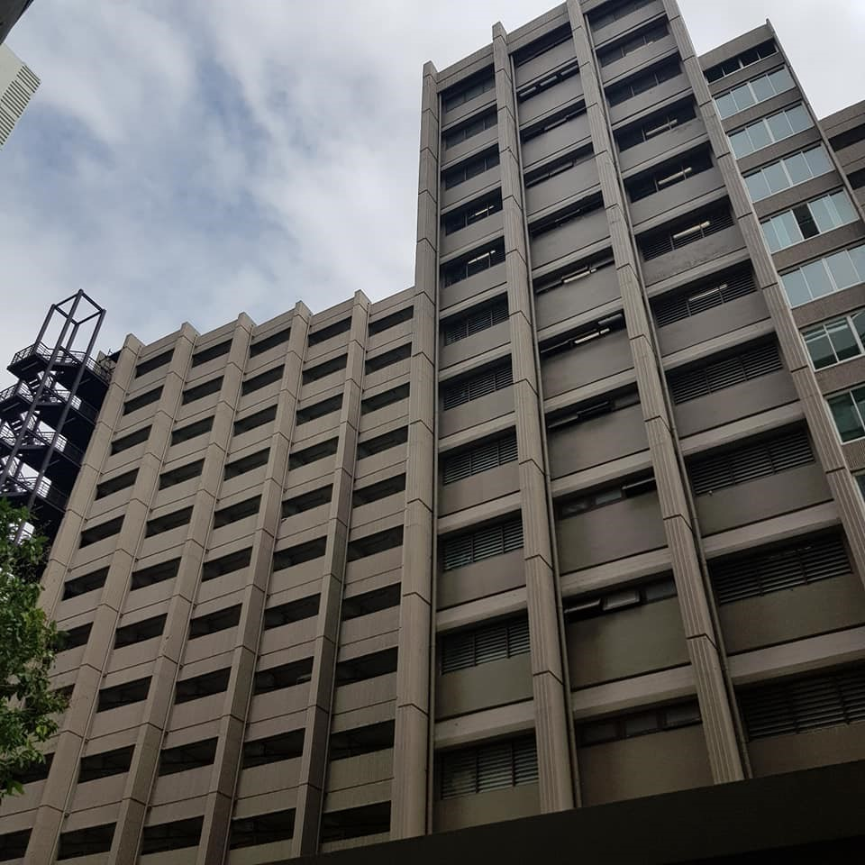

- ห้องโถงชั้นสอง ตึกพุดตาน

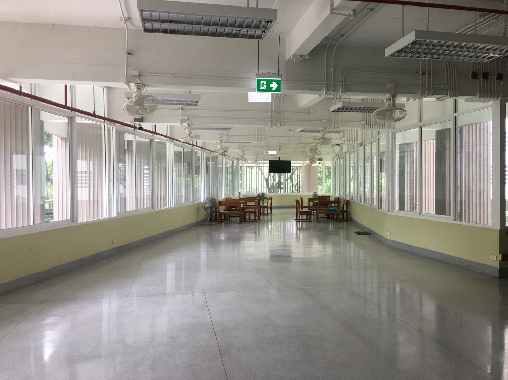

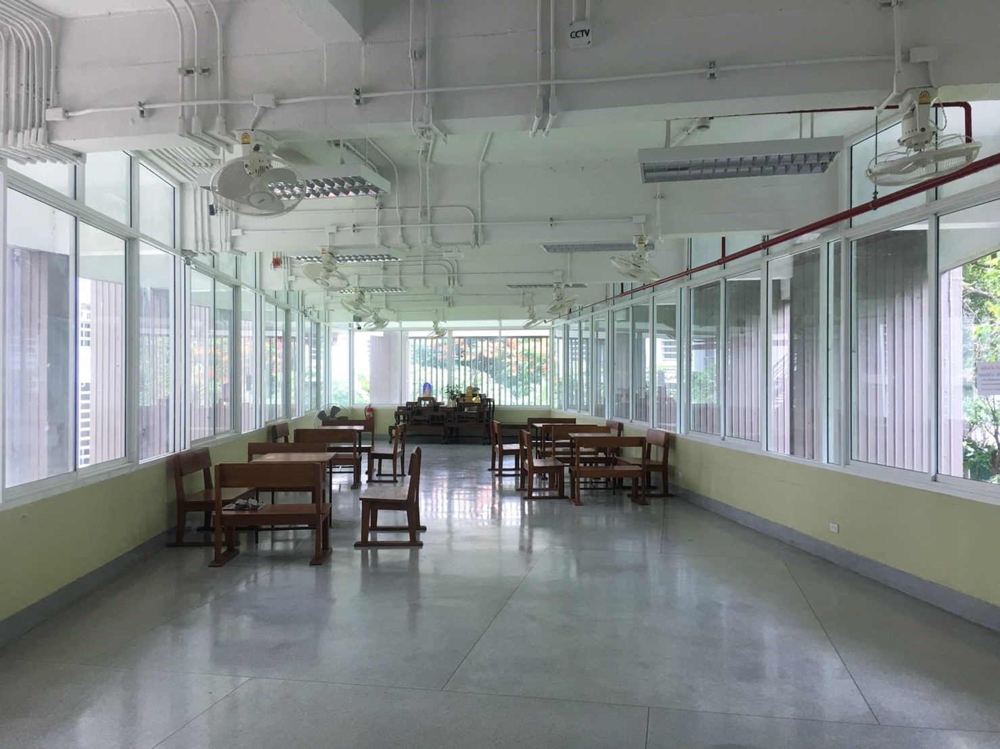

- ห้องน้ำ และ ห้องอาบน้ำสำหรับผู้ชาย (ชั้น 3-6 ของตึกพุดตาน)

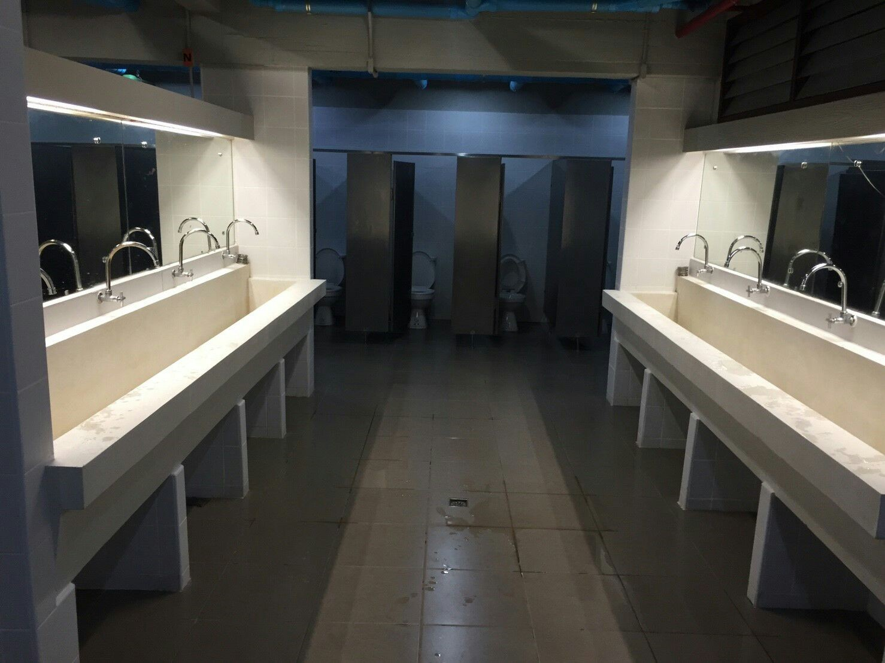

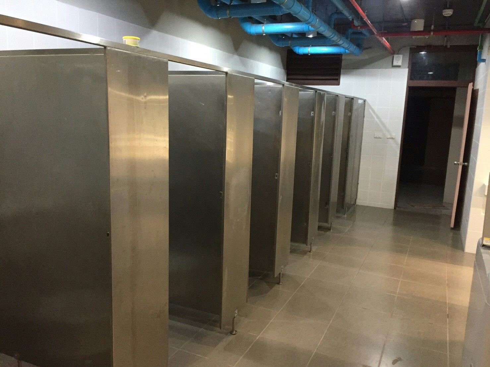

<h2 style="color: #F58FA3">ที่พักสำหรับผู้หญิง</h2>

-	อาคารอเนกประสงค์

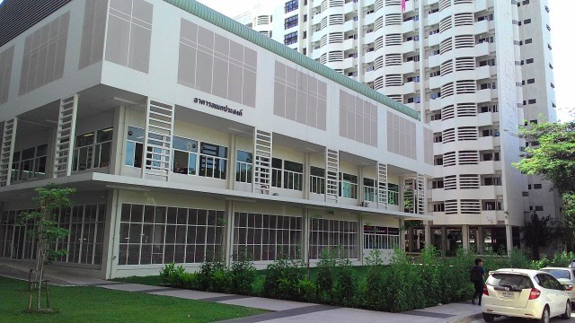

- ห้องโถงชั้น 2 ห้องคณะกรรมการนิสิตหอพัก และห้องประชุม 1 อาคารอเนกประสงค์

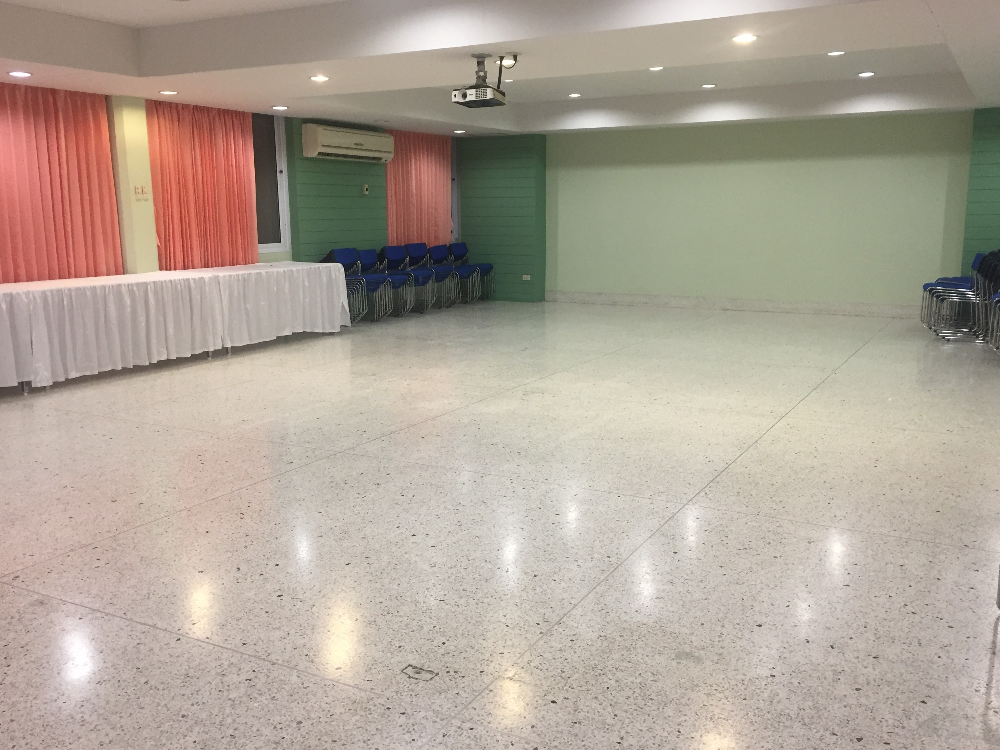

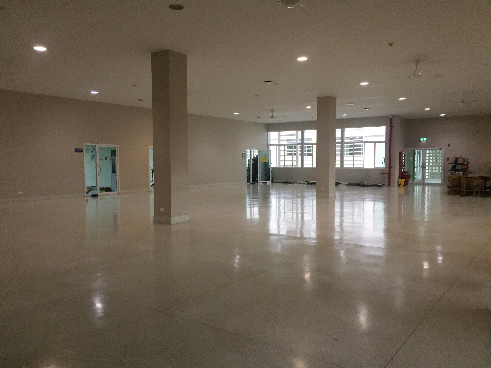

- ห้องน้ำ และ ห้องอาบน้ำสำหรับผู้หญิง (ชั้น 2 – 5 ของตึกพุดซ้อน)

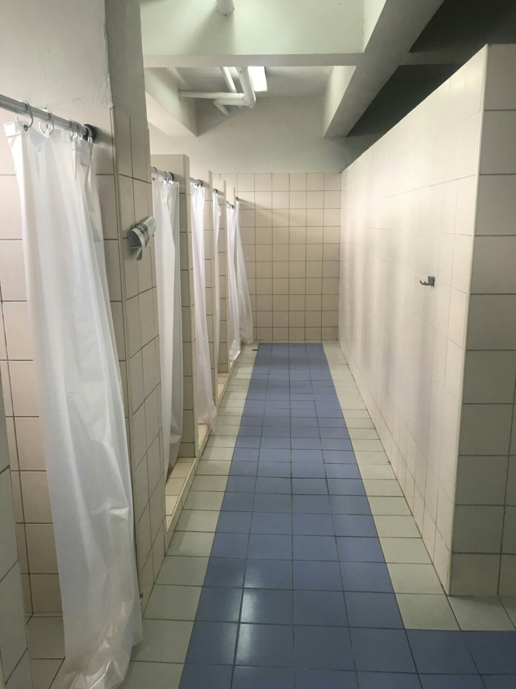 

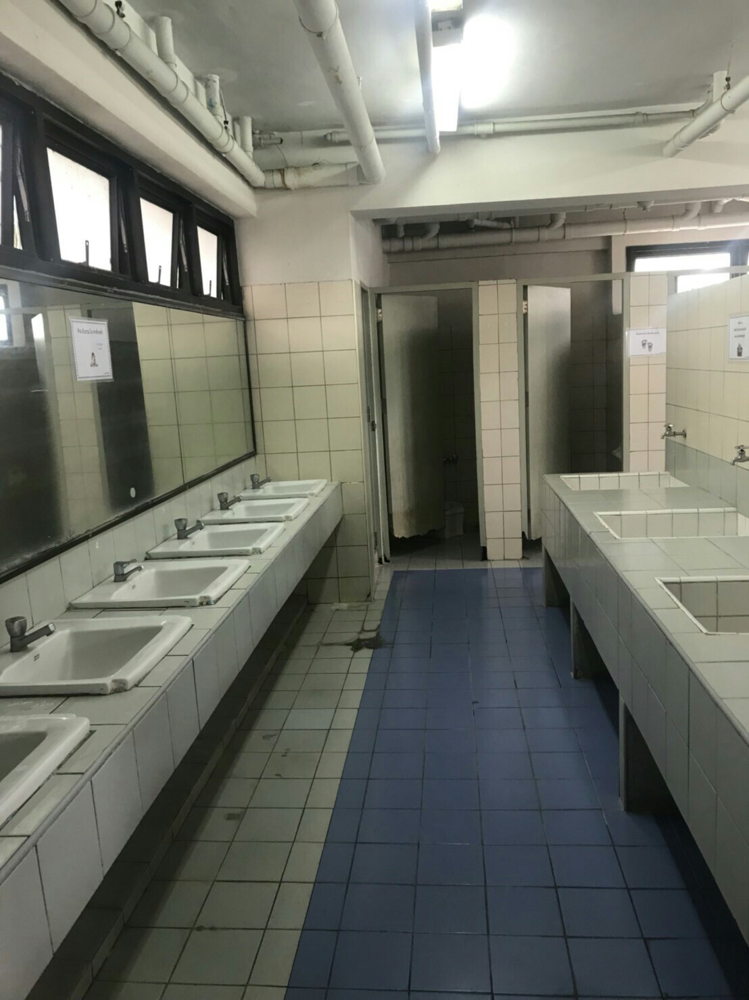

### แผนผังหอพักนิสิตจุฬาลงกรณ์มหาวิทยาลัย

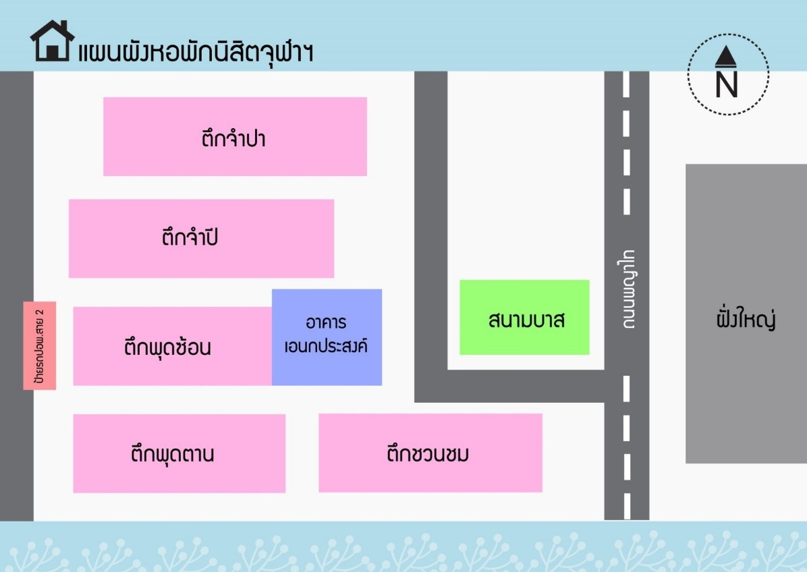

### ตารางเวลาการเข้าพัก

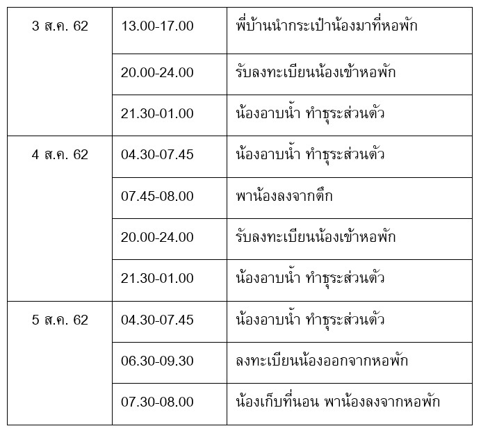

หมายเหตุ : หากน้องนอนคืนวันที่ 3 ส.ค. ถึงเช้าวันที่ 4 ส.ค. ให้ลงทะเบียนน้องออกจากหอพักภายในเวลา 06.30-09.30 น.

### หากมีข้อสงสัยหรือติดต่อสอบถาม

<strong>พี่โดนัท</strong> #3 088-716-0097 
<strong>พี่นอท</strong> #3 087-369-6286
